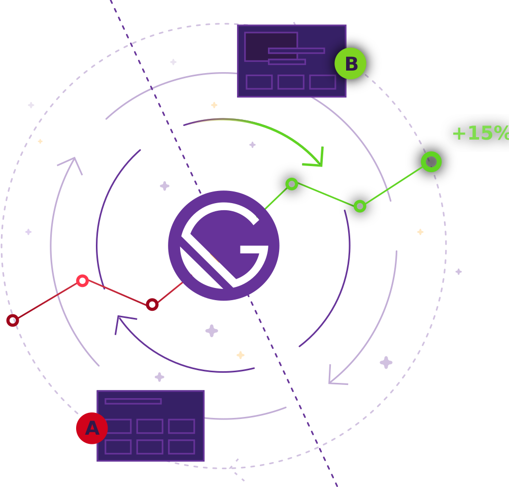

<p align="center">
  <a href="https://www.gatsbyjs.org">
    
  </a>
</p>

<h1 align="center">
  Gatsby Scalable Starter
</h1>
<p align="center">
  Gatsby starter that uses all the extras to get you up and running with scalable architecture, and workflow as fast as possible.
</p>

## What's inside?

- Gatsby (v3)
- Storybook (v6)
- Twind
- Tailwind Reset
- Netlify Config
- ESLint (Standard)
- Prettier
- React to SVG Generator
- React Hook utilities

## Quick start

```bash
$ gatsby new my-awesome-site https://github.com/LinnJS/gatsby-scalable-starter

$ cd my-awesome-site
$ yarn start || yarn develop
```

## Details

## How to work with `svg`s

You are welcome to come up with other solutions, but we typically do this:

1. `npm install -g svg-to-react-cli` (https://www.npmjs.com/package/svg-to-react-cli)
2. Navigate to the directory where there is your svg (e.g. `example.svg`)
3. Run `svgtoreact example Example`, this then creates `Example.js` (the React component for the svg). You can then import this component like any other React component.

## How to work via styles?

We use TailwindCSS to style components in this Gatsby Scalable Starter, but we used a CSS-in-JS library, Twind, that extends additional functionality so we can easily style with JS variables.

`Twind` (https://twind.dev/).

### How to theme with Twind?

- There is a setup function located in the root directory, this is where the theme is setup and extended

`Setup Function in Twind` (https://twind.dev/handbook/configuration.html#theme).

## Deploy

[](https://app.netlify.com/start/deploy?repository=https://github.com/markoradak/gatsby-starter-storybook)

## License

Licensed under the MIT License.  
See [license](LICENSE) for more information.
